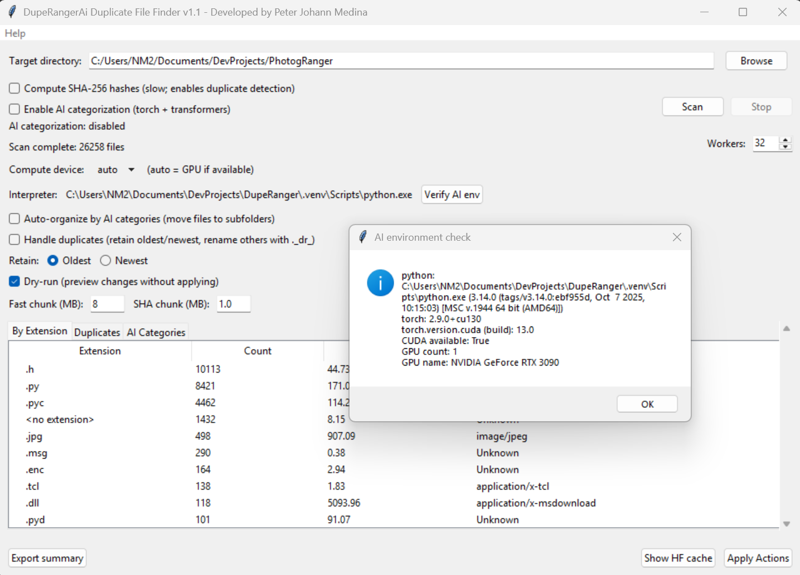

# DupeRangerAi - Intelligent Duplicate File Finder



**Version:** 1.1
**Platform:** Windows
**License:** MIT
## Overview

DupeRangerAi is an intelligent file organization tool that helps you:
# DupeRangerAi - Intelligent Duplicate File Finder

**Version:** 1.1
**Platform:** Windows
**License:** MIT

## Overview

DupeRangerAi is an intelligent file organization tool that helps you:

- **Detect Duplicate Files** using fast xxHash fingerprinting and SHA-256 verification
- **AI-Powered Categorization** using state-of-the-art language models from Hugging Face
- **Automatic Organization** by file type and AI-detected categories
- **Smart Duplicate Handling** with configurable primary file selection and safe renaming
- **Safe Operations** with preview, logging, and rollback capability

## Features

### 🔍 Duplicate Detection
- Fast initial fingerprinting using xxhash (configurable chunk sizes)
- SHA-256 verification for true duplicates
- Choose which file to keep (oldest or most recently modified)
- Automatically mark duplicates with `._dr_` prefix

### 🤖 AI Categorization
- Uses transformer-based models for intelligent file classification
- Categories: Photos, Videos, Audio, Documents, Archives, Code, Spreadsheets, Presentations, Backups, Miscellaneous
- GPU acceleration support (CUDA) with automatic fallback to CPU
- Zero-shot classification using DistilBART model

### 📁 File Organization
- Organize files into AI-detected category-based folders automatically
- Choose destination: subfolders in place or custom directory
- Smart collision handling with numbered suffixes
- Preserves original files until operations are confirmed

### 🛡️ Safety Features
- **Preview Dialog**: Review all planned operations before execution
- **Operation Logging**: Complete transaction log for rollback
- **Dry-run Mode**: Test operations without making changes
- **Error Handling**: Graceful handling of locked files, permission issues
- **Stop Button**: Cancel operations mid-execution

## Quick Start

### Prerequisites
- Python 3.8 or later
- Windows 10/11 (64-bit recommended)

### Installation

1. **Clone the repository:**
   ```bash
   git clone https://github.com/yourusername/duperangerai.git
   cd duperangerai
   ```

2. **Install dependencies:**
   ```powershell
   # For CPU-only (recommended for first use)
   .\install_deps.ps1

   # For GPU support (requires NVIDIA CUDA)
   .\install_deps.ps1 -UseGPU
   ```

3. **Run the application:**
   ```powershell
   python DupeRangerAi.py
   ```

### Basic Usage

1. **Launch**: Run `python DupeRangerAi.py`
2. **Select Directory**: Click "Browse" and choose the folder to scan
3. **Configure Options**:
   - Enable "Compute SHA-256 hashes" for duplicate detection
   - Optionally enable "AI categorization" (requires AI dependencies)
   - Configure worker count and chunk sizes based on your storage type
4. **Scan**: Click the "Scan" button
5. **Review Results** in the three tabs:
   - **By Extension**: File type summary
   - **Duplicates**: Detected duplicate files
   - **AI Categories**: AI-classified files (if enabled)
6. **Apply Actions** (optional):
   - Enable duplicate handling and/or auto-organization
   - Click "Apply Actions" to preview changes
   - Uncheck "Dry-run" and apply to execute changes

📖 **For detailed user instructions, see [USER_GUIDE.md](USER_GUIDE.md)** - a comprehensive consumer-friendly guide with step-by-step instructions, troubleshooting, and tips.

## Configuration Options

### Scanning Options
| Option | Description | Recommended |
|--------|-------------|-------------|
| **SHA-256 Hashes** | Compute cryptographic hashes for duplicate detection | Enable for duplicate finding |
| **AI Categorization** | Use AI to classify files by type | Enable if AI installed |
| **Workers** | Number of parallel threads | Auto-detected (CPU cores × 2) |
| **Fast Chunk (MB)** | Chunk size for xxhash | 8 MB (local), 1-4 MB (network) |
| **SHA Chunk (MB)** | Chunk size for SHA-256 | 1 MB (good default) |

### Performance Tuning by Storage Type
- **NVMe SSD**: Fast chunks 8-16MB, SHA chunks 1-2MB, workers CPU×2
- **SATA SSD/HDD**: Fast chunks 4-8MB, SHA chunks 0.5-1MB, workers CPU×1.5
- **Network/SMB**: Fast chunks 1-4MB, SHA chunks 0.25-0.5MB, workers 4-8 max
- **USB/External**: Fast chunks 0.5-2MB, SHA chunks 0.125-0.25MB, workers 2-4 max

## Building Standalone Executable

For users who prefer a standalone executable:

```powershell
# Build with PyInstaller
.\build_exe.ps1

# By default the build script targets the canonical entry `DupeRangerAi.py`.
# To build a different script (for example the lightweight non-grok variant
# `AiDupeRanger.py`), specify the entry script when running the build script:
```powershell
.\build_exe.ps1 -EntryScript "AiDupeRanger.py" -OutputDir "AiDupeRanger"
```

# The executable will be created in DupeRangerAi/DupeRangerAi.exe (default)
```

## Testing

Run the included tests to verify functionality:

```powershell
# Performance testing with synthetic data
python synthetic_test.py

# Action testing (file operations)
python test_actions.py
```

## Troubleshooting
## ⚠️ Deprecated variants

This repository historically included a few alternate entry scripts and packaging variants (e.g., `AiDupeRanger_grok`, `AiDupeRanger_claude`, and `AiDupeRanger.py`). These variants are now archived and should not be used for new builds — `DupeRangerAi.py` is the canonical main script.

If you need to inspect old variants, check `deprecated_variants/` where we keep archived copies and additional notes.


### "AI categorization unavailable"
**Cause:** PyTorch/Transformers not installed
**Solution:** Run `.\install_deps.ps1 -UseGPU` to install AI dependencies

### "Permission denied" errors
**Cause:** Files are open in another program or insufficient permissions
**Solution:**
- Close files before scanning
- Run as Administrator if needed
- Check file/folder permissions

### Slow scanning
**Causes & Solutions:**
- Large number of files: Reduce worker count
- AI categorization enabled: Consider CPU-only mode
- Network storage: Decrease chunk sizes
- Check antivirus exclusions

## Architecture

### Core Components
- **FileScanner**: Multi-threaded scanner using two-phase hashing
- **FileClassifier**: AI categorization via zero-shot classification
- **FileOrganizerApp**: Tkinter-based GUI with incremental updates
- **FileRecord/ScanResults**: Data structures for file metadata

### Key Design Patterns
- **Two-phase duplicate detection**: Fast xxhash → SHA-256 verification
- **Threaded execution**: Configurable worker pools with Queue-based UI updates
- **GPU/CPU fallback**: Automatic device detection with graceful degradation
- **Preview-before-apply**: All file operations shown in preview dialog

## Contributing

1. Fork the repository
2. Create a feature branch (`git checkout -b feature/amazing-feature`)
3. Commit your changes (`git commit -m 'Add amazing feature'`)
4. Push to the branch (`git push origin feature/amazing-feature`)
5. Open a Pull Request

## Copyright

**DupeRangerAi** is developed by **Peter Johann Medina**.

For more information about the developer and additional projects, visit: [https://ReclaimDev.com](https://ReclaimDev.com)

Copyright (c) 2025 Peter Johann Medina. All rights reserved.

## License

This project is licensed under the MIT License - see the [LICENSE](LICENSE) file for details.

## Acknowledgments

- **AI Models**: Hugging Face Transformers (DistilBART)
- **Libraries**: PyTorch, Tkinter, xxhash
- **Inspiration**: ZFS file organization concepts

---

**Happy organizing!** 🚀